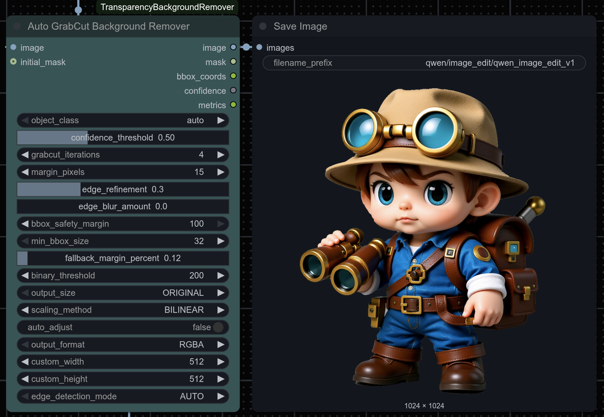
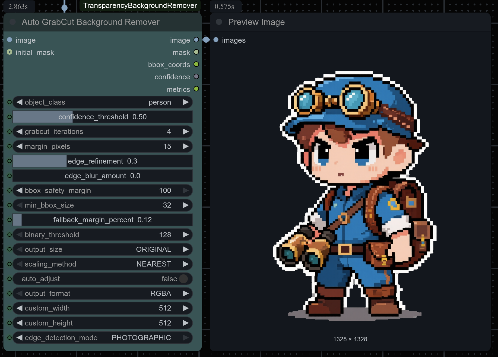

# ComfyUI-TransparencyBackgroundRemover

## Intelligent Background Removal Node for ComfyUI

**ComfyUI-TransparencyBackgroundRemover** is a powerful custom node that automatically removes backgrounds from images using advanced AI-powered detection algorithms. Designed for seamless integration with ComfyUI workflows, this node excels at preserving fine edges and details while generating high-quality transparency masks.

### ✨ Key Features

- 🆕 **Content-Aware Edge Detection** - Automatically adapts processing for **Pixel Art** or **Photographic** images to achieve the best results.
- 🎯 **Multi-Method Algorithm** - Combines Roberts Cross, Sobel, and Canny edge detection for superior accuracy and detail preservation.
- 🖼️ **Advanced Edge Refinement** - Specialized algorithms for crisp, pixel-perfect boundaries in pixel art and smooth, clean edges in photos.
- 🔄 **Batch Processing Support** - Process multiple images efficiently in a single operation.
- 📐 **Power-of-8 Scaling** - Optimized scaling with NEAREST neighbor interpolation for pixel-perfect results.
- 🎨 **Multiple Output Formats** - RGBA with embedded alpha or RGB with separate mask.
- 🖥️ **Dither Pattern Handling** - Specialized processing for pixel art and dithered images.
- ⚙️ **Highly Customizable** - Fine-tune parameters for different image types and requirements.


<!-- Auto GrabCut Examples -->
<p align="center">
  
  
</p>

<!-- GrabCut Background Remover Examples -->
<p align="center">
  
</p>

<p align="center">
  
</p>

---

## 📦 Installation

### Method 1: ComfyUI Manager (Recommended)

1. Open ComfyUI and navigate to **Manager** → **Install via Git URL**
2. Enter the repository URL:
   ```
   https://github.com/Limbicnation/ComfyUI-TransparencyBackgroundRemover
   ```
3. Click **Install** and restart ComfyUI
4. The node will appear under **image/processing** category

### Method 2: Manual Installation

1. **Clone the repository** to your ComfyUI custom nodes directory:
   ```bash
   cd ComfyUI/custom_nodes/
   git clone https://github.com/Limbicnation/ComfyUI-TransparencyBackgroundRemover.git
   ```

2. **Install dependencies**:
   ```bash
   cd ComfyUI-TransparencyBackgroundRemover
   pip install -r requirements.txt
   ```

3. **Restart ComfyUI** to load the new node

### Required Dependencies

- `torch` - PyTorch for tensor operations
- `numpy` - Numerical computing
- `Pillow` - Image processing
- `opencv-python` - Computer vision operations
- `scikit-learn` - Machine learning algorithms for clustering

### ⚠️ Important: Dependency Installation

**The node requires scikit-learn to function at full capacity.** If you see a `ModuleNotFoundError` when loading ComfyUI, use one of these installation methods:

#### Quick Installation (Recommended)

**Windows (ComfyUI App/Portable):**
```batch
cd custom_nodes\ComfyUI-TransparencyBackgroundRemover
install.bat
```

**Linux/Mac:**
```bash
cd custom_nodes/ComfyUI-TransparencyBackgroundRemover
chmod +x install.sh
./install.sh
```

**Manual Installation:**
```bash
pip install -r requirements.txt
```

#### Graceful Degradation
The node will work without scikit-learn, but with reduced accuracy (~85-90% instead of 100%). Color clustering detection will be disabled, which may affect background removal quality for small-to-medium images with complex backgrounds.

---

## 🎛️ Node Parameters

### Core Processing Parameters

| Parameter | Type | Range | Default | Description |
|-----------|------|-------|---------|-------------|
| **tolerance** | INT | 0-255 | 30 | Color similarity threshold for background detection. Lower values = more selective background detection |
| **edge_sensitivity** | FLOAT | 0.0-1.0 | 0.8 | Edge detection sensitivity. Higher values = more edge detail preservation |
| **foreground_bias** | FLOAT | 0.0-1.0 | 0.7 | Bias towards preserving foreground elements. Higher values = stronger foreground protection |
| **color_clusters** | INT | 2-20 | 8 | Number of color clusters for background analysis. More clusters = finer color distinction |
| **binary_threshold** | INT | 0-255 | 128 | Threshold for generating binary alpha masks. Higher values = more opaque areas |

### Output & Scaling Options

| Parameter | Type | Options | Default | Description |
|-----------|------|---------|---------|-------------|
| **output_size** | DROPDOWN | ORIGINAL, 64x64, 96x96, 128x128, 256x256, 512x512, 768x768, 1024x1024, 1280x1280, 1536x1536, 1792x1792, 2048x2048 | ORIGINAL | Target output dimensions (power-of-8 for optimal scaling) |
| **scaling_method** | DROPDOWN | NEAREST | NEAREST | Interpolation method. NEAREST preserves pixel-perfect detail for pixel art |
| **output_format** | DROPDOWN | RGBA, RGB_WITH_MASK | RGBA | Output format: RGBA (transparency embedded) or RGB with separate mask |

### Advanced Options

| Parameter | Type | Options | Default | Description |
|-----------|------|---------|---------|-------------|
| **edge_detection_mode** | DROPDOWN | AUTO, PIXEL_ART, PHOTOGRAPHIC | AUTO | Selects the edge detection pipeline. AUTO intelligently detects content type. |
| **edge_refinement** | BOOLEAN | | True | Apply post-processing edge refinement for smoother boundaries |
| **dither_handling** | BOOLEAN | | True | Enable specialized processing for dithered patterns and pixel art |
| **batch_processing** | BOOLEAN | | True | Process all images in batch (True) or only first image (False) |

---

## 🚀 Usage Examples

### Basic Background Removal

1. **Load your image** using any ComfyUI image loader node
2. **Connect the image output** to the `image` input of the TransparencyBackgroundRemover node
3. **Adjust parameters** based on your image type:
   - **For most images**: Leave `edge_detection_mode` on `AUTO`.
   - **For specific needs**: Manually select `PIXEL_ART` or `PHOTOGRAPHIC` to override the automatic detection.
4. **Connect the outputs** to preview or save nodes

### Batch Processing Workflow

```
Load Images (Batch) → TransparencyBackgroundRemover → Save Images
                                  ↓
                            (Set batch_processing = True)
```

### Pixel Art Optimization

**Recommended settings for pixel art:**
- `edge_detection_mode`: `PIXEL_ART` (or `AUTO`)
- `tolerance`: 10-20
- `edge_sensitivity`: 0.9-1.0
- `color_clusters`: 4-8
- `dither_handling`: True
- `scaling_method`: NEAREST
- `output_size`: Power-of-8 dimensions (256x256, 512x512, etc.)

### High-Quality Photo Processing

**Recommended settings for photographs:**
- `edge_detection_mode`: `PHOTOGRAPHIC` (or `AUTO`)
- `tolerance`: 25-40
- `edge_sensitivity`: 0.7-0.8
- `foreground_bias`: 0.8-0.9
- `color_clusters`: 10-16
- `edge_refinement`: True

---

## 📋 Workflow Integration

### Example Workflow JSON
```json
{
  "nodes": [
    {
      "type": "LoadImage",
      "pos": [100, 100]
    },
    {
      "type": "TransparencyBackgroundRemover",
      "pos": [400, 100],
      "inputs": {
        "edge_detection_mode": "AUTO",
        "tolerance": 30,
        "edge_sensitivity": 0.8,
        "output_format": "RGBA"
      }
    },
    {
      "type": "PreviewImage", 
      "pos": [700, 100]
    }
  ]
}
```

### Node Connections
- **Input**: Connect any IMAGE output to the `image` input
- **Outputs**: 
  - `image` → Connect to preview, save, or further processing nodes
  - `mask` → Use for compositing, masking, or additional processing

---

## 🎯 Auto GrabCut Background Remover

### Overview
The **Auto GrabCut Background Remover** node provides advanced object detection and segmentation using YOLO and GrabCut algorithms. It can automatically detect objects in images and remove backgrounds with high precision, or refine existing masks for better quality.

### Key Features
- **Automatic Object Detection**: Uses YOLO to identify objects (person, product, vehicle, animal, furniture, electronics)
- **GrabCut Refinement**: Advanced segmentation algorithm for precise edge detection
- **Resize Functionality**: Scale output to preset or custom dimensions
- **Multiple Scaling Methods**: NEAREST (pixel-perfect), BILINEAR, BICUBIC, LANCZOS
- **Mask Refinement**: Improve existing masks from other background removal tools

### Node Parameters

#### Auto GrabCut Remover

| Parameter | Type | Range/Options | Default | Description |
|-----------|------|---------------|---------|-------------|
| **object_class** | DROPDOWN | auto, person, product, vehicle, animal, furniture, electronics | auto | Target object class for detection |
| **confidence_threshold** | FLOAT | 0.3-0.9 | 0.5 | Minimum confidence for object detection |
| **grabcut_iterations** | INT | 1-10 | 5 | Number of GrabCut algorithm iterations |
| **margin_pixels** | INT | 0-50 | 20 | Pixel margin around detected object |
| **edge_refinement** | FLOAT | 0.0-1.0 | 0.7 | Edge refinement strength (0=none, 1=maximum) |
| **edge_blur_amount** | FLOAT | 0.0-10.0 | 0.0 | Amount of Gaussian blur applied to mask edges for softer transitions (0=sharp edges, 10=maximum smoothing) |
| **binary_threshold** | INT | 128-250 | 200 | Threshold for binary mask conversion |
| **output_size** | DROPDOWN | ORIGINAL, 512x512, 1024x1024, 2048x2048, custom | ORIGINAL | Target output dimensions |
| **scaling_method** | DROPDOWN | NEAREST, BILINEAR, BICUBIC, LANCZOS | NEAREST | Interpolation method for scaling |
| **output_format** | DROPDOWN | RGBA, MASK | RGBA | Output format type |
| **auto_adjust** | BOOLEAN | True/False | False | Automatically adjust parameters based on image content analysis |

#### Optional Parameters
| Parameter | Type | Range | Default | Description |
|-----------|------|-------|---------|-------------|
| **initial_mask** | MASK | - | - | Initial mask from previous processing |
| **custom_width** | INT | 64-4096 | 512 | Custom width (when output_size is 'custom') |
| **custom_height** | INT | 64-4096 | 512 | Custom height (when output_size is 'custom') |

### Usage Examples

#### Basic Object Removal
1. Connect your image to the Auto GrabCut node
2. Select the appropriate `object_class` (or leave as "auto")
3. Adjust `confidence_threshold` if needed
4. Choose your desired `output_size` and `scaling_method`
5. Run the workflow

#### Mask Refinement
Use the **GrabCut Refinement** node to improve masks from other sources:
1. Connect an image and its existing mask
2. Adjust `grabcut_iterations` for refinement quality
3. Set `edge_refinement` for smoothing
4. Configure `edge_blur_amount` for desired edge softness:
   - `0.0`: Preserve existing sharp edges
   - `0.5-1.0`: Light feathering for natural blending
   - `1.5-3.0`: Soft edges for seamless compositing
5. Apply resize options if needed

#### Edge Quality Control Examples

**Sharp Pixel-Perfect Edges** (ideal for pixel art, logos):
```
edge_blur_amount: 0.0
binary_threshold: 220-250
edge_refinement: 0.3-0.5
scaling_method: NEAREST
```

**Natural Photo Edges** (portraits, objects):
```
edge_blur_amount: 0.8-1.5
binary_threshold: 180-200
edge_refinement: 0.7-0.9
scaling_method: BILINEAR or BICUBIC
```

**Soft Composite Blending** (backgrounds, overlays):
```
edge_blur_amount: 2.0-5.0
binary_threshold: 160-180
edge_refinement: 0.8-1.0
scaling_method: BICUBIC or LANCZOS
```

**Product Photography** (clean commercial look):
```
edge_blur_amount: 0.3-0.8
binary_threshold: 200-230
edge_refinement: 0.6-0.8
object_class: "product"
```

---

## 🔧 Technical Details

### Supported Image Formats
- **Input**: RGB/RGBA images as ComfyUI tensors
- **Output**: RGBA images with transparency or RGB + separate mask
- **Batch Format**: 4D tensors `[batch, height, width, channels]`

### Performance Considerations
- **Memory Usage**: ~2-4x input image size during processing
- **Batch Processing**: Processes images sequentially with progress indicators
- **Minimum Size**: 64x64 pixels required
- **Recommended**: Use power-of-8 dimensions for optimal scaling performance

### Algorithm Overview
1. **Content-Aware Analysis**: Detects if the image is pixel art or photographic to select the best pipeline.
2. **Multi-Method Edge Detection**: Combines Roberts Cross, Sobel, and Canny algorithms for a robust edge map.
3. **Color Analysis**: K-means clustering to identify dominant background colors.
4. **Edge Refinement**: Applies specialized, content-aware filters to preserve sharp pixel art lines or create smooth photo edges.
5. **Alpha Generation**: Creates a soft mask with configurable thresholds.
6. **Post-Processing**: Optional dither handling and final enhancements.

### Edge Blur Processing
The Auto GrabCut nodes include advanced edge blur functionality for creating soft mask transitions:

#### Edge Blur Algorithm
- **Gaussian Blur Implementation**: Uses OpenCV's GaussianBlur with dynamic kernel size calculation
- **Kernel Size Formula**: `kernel_size = int(edge_blur_amount * 2) * 2 + 1` (ensures odd kernel size)
- **Range Constraints**: Kernel size is clamped between 3 and 21 pixels for optimal performance (effective max blur ~10.0)
- **Adaptive Processing**: blur_amount of 0.0 bypasses blur processing entirely for maximum performance

#### When to Use Edge Blur vs Binary Threshold
- **Edge Blur (edge_blur_amount > 0.0)**: Creates soft, feathered edges ideal for natural blending
  - Best for: Composite images, smooth transitions, photographic subjects
  - Processing: Applies Gaussian blur to 0-255 mask values, preserves anti-aliasing
- **Binary Threshold (edge_blur_amount = 0.0)**: Creates sharp, pixel-perfect edges
  - Best for: Pixel art, technical illustrations, crisp masking requirements
  - Processing: Applies binary threshold to eliminate semi-transparency

#### Performance Considerations
- **Zero-Cost Bypass**: When `edge_blur_amount = 0.0`, blur processing is completely skipped
- **Memory Usage**: Edge blur processing requires temporary 8-bit mask conversion
- **Quality vs Speed**: Higher blur amounts (3.0+) provide smoother results but increase processing time

### Auto-Parameter Adjustment
When `auto_adjust` is enabled, the Auto GrabCut nodes intelligently analyze image characteristics and optimize parameters for best results:

#### Edge Blur Auto-Adjustment
The system automatically adjusts `edge_blur_amount` based on image analysis:

- **High Edge Density Images** (detailed textures, complex patterns):
  - Increases blur by +0.5 from base value (max 3.0)
  - Helps smooth out noise and create cleaner masks

- **Low Edge Density Images** (simple shapes, solid colors):
  - Decreases blur by -0.5 from base value (min 0.0)
  - Preserves sharp edges for clean geometric shapes

- **High Noise Images** (photographs with grain, artifacts):
  - Increases blur by +0.25 from base value
  - Reduces mask noise while maintaining edge quality

#### Auto-Adjustment Ranges
- **edge_blur_amount**: Adjusted within 0.0-3.0 range (safer than manual 5.0 maximum)
- **Analysis-Based**: Considers edge density, color variance, and noise characteristics
- **Conservative Adjustments**: Small incremental changes preserve user intent while optimizing quality
- **First Image Only**: In batch processing, analysis is performed on the first image and applied to all

---

## 🐛 Troubleshooting

### Common Issues

**"ModuleNotFoundError: No module named 'sklearn'" or "'scikit-learn'"**
- This means scikit-learn is not installed in your ComfyUI Python environment
- **Solution 1 (Windows)**: Run `install.bat` in the custom node directory (double-click or run from command prompt)
- **Solution 2 (Linux/Mac)**: Run `./install.sh` in the custom node directory
- **Solution 3 (Manual)**: Install with `pip install scikit-learn` in your ComfyUI Python environment
- **Note**: The node will still work without sklearn but with ~10-15% reduced accuracy (color clustering disabled)
- After installation, restart ComfyUI

**"Input image must be at least 64x64 pixels"**
- Ensure your input images meet the minimum size requirement
- Use an upscaling node if needed before processing

**"Insufficient memory for processing"**
- Reduce batch size or process images individually
- Set `batch_processing` to False for large images
- Close other memory-intensive applications

**Poor background detection**
- Try switching the `edge_detection_mode` between `PIXEL_ART` and `PHOTOGRAPHIC`.
- Adjust `tolerance` for similar colors.
- Modify `color_clusters` (more clusters for complex backgrounds).

**Jagged or blurry edges**
- Ensure `edge_detection_mode` is set correctly (`PIXEL_ART` for sharp edges, `PHOTOGRAPHIC` for smooth).
- Enable `edge_refinement`.
- Adjust `edge_sensitivity`.

**Edge quality issues with Auto GrabCut nodes**
- **Edges too sharp/harsh**: Increase `edge_blur_amount` to 0.5-2.0 for softer transitions
- **Edges too soft/blurry**: Decrease `edge_blur_amount` to 0.0-0.5, or set to 0.0 for pixel-perfect edges
- **Inconsistent edge quality**: Balance `edge_refinement` and `edge_blur_amount` - lower refinement when using higher blur amounts
- **Poor composite blending**: Use `edge_blur_amount` 1.5-5.0 with `binary_threshold` 160-180 for seamless integration
- **Pixel art corruption**: Set `edge_blur_amount` to 0.0 and use `scaling_method` NEAREST to preserve crisp pixels
- **Processing too slow**: High `edge_blur_amount` values (>5.0) increase processing time - use lower values when possible

---

## 🤝 Contributing

Contributions are welcome! Please feel free to submit issues, feature requests, or pull requests.

### Development Setup
```bash
git clone https://github.com/Limbicnation/ComfyUI-TransparencyBackgroundRemover.git
cd ComfyUI-TransparencyBackgroundRemover
pip install -r requirements.txt
```

---

## 📄 License

This project is licensed under the MIT License - see the [LICENSE](LICENSE) file for details.

---

## 🙏 Acknowledgments

- ComfyUI team for the excellent framework
- Community contributors and testers
- Built with ❤️ for the AI art community

---

## 📞 Support

- **Issues**: [GitHub Issues](https://github.com/Limbicnation/ComfyUI-TransparencyBackgroundRemover/issues)
- **Documentation**: [Project Wiki](https://github.com/Limbicnation/ComfyUI-TransparencyBackgroundRemover/wiki)
- **Discussions**: [GitHub Discussions](https://github.com/Limbicnation/ComfyUI-TransparencyBackgroundRemover/discussions)
